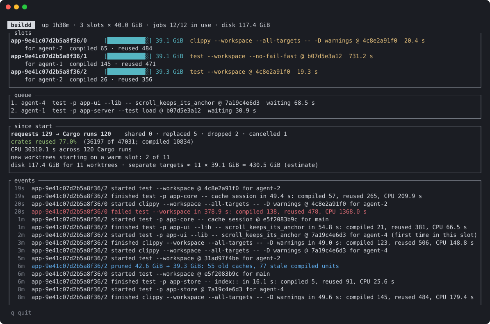

# buildd

Coordinates the Cargo builds of many concurrent sessions (coding agents,
editors, people) on one machine, so that build disk stays fixed and builds
share one CPU budget instead of each assuming it owns the machine.

## How it works

- **Sessions never build in their worktree.** `buildd check` (or `clippy`,
  `build`, `test`) snapshots the worktree's current content, committed or
  not, as a git tree. Tracked files and untracked files git does not ignore
  are included. The tree id is the revision every result reports.
- **Build slots.** The daemon checks that tree out into a slot: a checkout at
  a fixed path with the only target directory that path ever uses. Checking
  out writes only the files that differ from the slot's previous build, so
  Cargo sees ordinary edits and incremental compilation stays warm. Each
  repository gets at most `slots` slot directories, created only when its
  builds run concurrently, so build disk depends on the slot count rather
  than the number of sessions or worktrees.
- **Best slot.** A build takes the idle slot where Cargo has the least to
  do: the fewest compiled units it needs and the slot lacks, plus how far
  the slot's checkout is from the build's tree. What a build needs is what
  the latest build of the same compilation (directory, command and Cargo
  arguments) used, in any slot, learned from Cargo's reports; unit hashes
  are the same in every slot. A compilation that never ran is assumed to
  need what builds of the same command used, so a single crate's tests go
  to the slot that ran the whole suite. Distance is the packages Cargo
  compiles again: the paths that differ (`git diff-tree`), each changed
  package counted with every workspace package that depends on it, learned
  from `cargo metadata`, and a lockfile or build-configuration change
  counting all of them. It never waits for a busy slot while another is
  idle.
- **One CPU budget.** Every Cargo the daemon runs shares one jobserver with
  `jobs` tokens.
- **Deduplication and supersession.** A request equal to a queued or running
  build (same repository, tree, directory, command and arguments) waits for
  that build. A newer request from a worktree replaces its own queued older
  ones at their place in the queue.
- **Cancellation.** Closing the client (Ctrl-C) withdraws the request. A
  build nobody waits for any more is stopped with its whole process group.
- **Restarts keep slots warm.** Each slot records the compilations it ran
  and the worktree it last built for; a restarted daemon takes its slots
  back, with their checkouts and targets, and removes any beyond `slots`.
- **Disk limit.** A slot's target is kept within `slot_limit_gib` once the
  slot has been idle for two seconds, so measuring it never delays the next
  build of a session running several in a row, and right after a build once
  eight builds went unmeasured. It removes what builds used longest ago
  first: incremental caches, and compiled units (a crate's outputs,
  fingerprint and build-script directory, all named by its hash). The daemon
  records when builds use each unit from Cargo's own reports, so units of
  old feature sets, profiles and dependency versions go before ones in use;
  Cargo just recompiles a removed unit if a build needs it again. The whole
  target goes only when nothing else is left. Build disk per repository is
  therefore at most `slots` times the limit, plus what builds add between
  measurements.
- **Sizing.** A slot's limit must hold the working set of the builds it
  serves; below that, keeping to it removes caches in use and those builds
  compile from scratch, many times slower. `buildd status` and the daemon
  log flag such a slot. Fewer, larger slots beat more, smaller ones: on
  the 60-crate workspace buildd was built for, check and test builds of a
  few crates need 12–15 GiB per slot, and 4 slots of 8 GiB were several
  times slower than 2 of 15. Full-workspace `test` and
  `clippy --all-targets` from several worktrees, as agents run them before
  each commit, need about 30 GiB per slot: at 20 GiB a slot's compiled
  artifacts alone outgrew the limit and its target was cleared.

## Snapshots, trees and slots

Every build is named by a git tree: a snapshot of a directory whose id is a
hash of its content. buildd uses it as an exact, cheap name for "this
worktree's files, right now".

### What a tree is

Git stores each file's content as a blob named by the hash of its bytes. A
tree lists names and the blob or subtree each points to, and is itself
named by the hash of that list.

```text
tree 7f3a…                         ← one id names the whole snapshot
├── Cargo.toml   → blob 1c2d…
├── Cargo.lock   → blob 88e0…
└── crates/      → tree 4b91…
    ├── domain/  → tree a0f3…
    │   └── src/lib.rs → blob 5e77…
    └── gui/     → tree c2d8…
        └── src/lib.rs → blob 9b14…
```

Identical content gives an identical id in any worktree. Editing one file
changes its blob id, its folder's tree id, and so on up to the top.

### Snapshotting a worktree

For each request the daemon writes the worktree's current content as a tree
(about 0.1 s on a 600k-line workspace):

```text
worktree on disk          private copy of           git objects
(committed + uncommitted  the worktree's index      (shared by all worktrees
 + new files)             ($BUILDD_HOME/tmp)         of the repository)

  crates/gui/src/lib.rs ─┐
  (edited, not staged)   │  git add --all  ┌──────────┐  a new blob only for
                         ├────────────────▶│ temp     │──▶ each changed file
  new_file.rs ───────────┘                 │ index    │
  target/, ignored files ✗ skipped         └────┬─────┘
                                                │ git write-tree
                                                ▼
                                        tree 7f3a…  = the revision
```

- The copy starts from the worktree's own index, whose cached file sizes and
  times let git rehash only the files that changed.
- Unchanged files keep their blob ids, so a snapshot stores only the new
  versions of edited files.
- The worktree's own index, and anything staged in it, are never touched,
  so the agents sharing a worktree see no change.

### What the tree id gives

- **Deduplication.** Two requests for the same repository, tree, directory,
  command and arguments are one build.
- **Honest results.** Every result names the tree that was compiled, never
  "whatever was on disk".
- **Cheap distances.** `git diff-tree` compares two trees by id and skips
  every folder whose id matches, so finding the few paths that differ
  between two snapshots of a large workspace takes milliseconds. The
  scheduler uses that count to choose the slot with the least to recompile.

```text
tree 7f3a (slot holds)        tree 3d2e (request)
crates/ → 4b91           vs   crates/ → 6e02        differ: descend
  domain/ → a0f3                domain/ → a0f3      same id: skip
  gui/    → c2d8                gui/    → f417      differ: descend
     src/lib.rs → 9b14             src/lib.rs → 0c55   changed file
```

### Checking a tree out into a slot

A slot's checkout is a small git repository of its own whose objects come
from the source repository, so checking out copies nothing up front and
writes only what differs:

```text
slots/<repo>-<hash>/<n>/src
  .git/objects/info/alternates ──▶ the source repository's objects
                                   (every blob readable, nothing copied)

  1. git commit-tree <tree>   wrap the tree in a commit (fixed author and
                              date, so one tree is always one commit)
  2. git reset --hard <commit>
                              compare with what the checkout holds:
                                same blob id    → file untouched
                                different id    → file rewritten
                                not in the tree → file deleted
  3. git clean -ffdx          remove anything a build left behind
```

Only rewritten files get new modification times, which is what Cargo's
fingerprints look at, so Cargo sees an ordinary small edit and recompiles
only what depends on those files. The checkout's path never changes, and
neither does the target directory next to it
(`slots/<repo>-<hash>/<n>/target`), so its incremental state stays valid.
A target directory never sees a second path: sharing one between paths
lets Cargo judge stale artifacts fresh.

### One caveat

Snapshot trees are not referenced by any branch, so git's garbage
collection may delete them, by default once they are two weeks old. A
build needs its tree for seconds, so this is harmless; it does mean a
revision id is a short-lived build handle, not a name to keep.

## Use

```sh
cargo install --path . --root ~/.local
cd some/worktree
buildd check -p my-crate        # starts the daemon on first use
buildd test -p my-crate -- some_test
buildd status
buildd top                      # watch it work; q quits
```

Set `BUILDD_LABEL` (an agent's or task's name) so `buildd top` and
`buildd status` show who asked; otherwise a request is named by its
worktree's folder.

## Watching it: `buildd top`



From real use, with names changed: eleven agent worktrees of one
workspace shared three 40 GiB slots for 1 h 38 min. All three slots run
full-workspace tests or Clippy while two builds wait, a pruning pass removed
stale compiled units instead of clearing a target, and the daemon estimates
that one target per worktree would have taken 430 GiB against the slots'
117 GiB.

What the numbers mean, all measured by the daemon since it started:

- **requests → Cargo runs.** The difference is work that never ran: requests
  that joined an equal build (shared), queued requests that moved to a newer
  tree of their worktree (replaced), and builds nobody waited for any more
  (dropped before starting, cancelled while running).
- **crates reused.** Cargo reports every crate of a build as compiled or up
  to date; the share up to date is what incremental state in the slots saved.
- **CPU.** User and system time of each Cargo run and every compiler it
  started.
- **new worktrees starting on a warm slot.** The first build of a worktree
  that ran in a slot which had already done its compilation, instead of a
  cold build in a fresh target.
- **separate targets.** Worktrees served times the average measured slot
  size: an estimate of the disk one target per worktree would take.

Arguments are passed to Cargo unchanged, except those that would take the
slot's target directory, checkout, output format or parallelism away from
the daemon (`--target-dir`, `--manifest-path`, `--message-format`,
`--config`, `-j`, `-Z`, ...), which are rejected.

State lives in `$BUILDD_HOME`, by default `buildd` in the user cache
directory (`~/Library/Caches/buildd` on macOS, `~/.cache/buildd` on Linux):

```text
config.toml        slots = 2, jobs = <CPUs>, slot_limit_gib = 20 by default
sock               the daemon's socket
daemon.log         output of a daemon a client started
slots/<repo>-<hash>/repository     the repository these slots build
slots/<repo>-<hash>/<n>/{src,target,record.json}
```

## Load test

`bench/load.py` runs many sessions against one Cargo workspace, each in its
own worktree editing one crate and asking for `check` and `test --no-run`,
either through a buildd daemon it starts or with plain Cargo and one target
per worktree. It reports time to finish, latency, queue time and peak disk.

```sh
bench/load.py --repository ~/src/project --base HEAD --workdir /tmp/load \
  --mode buildd --buildd-home ~/Library/Caches/buildd-load --sessions 15 \
  --crates crate-a,crate-b --think 45-120 --report load.json
```

## Protocol

One JSON object per line over the Unix socket; see `src/protocol.rs`.
`build` streams a build's messages, `status` describes the slots and queue,
and `activity` adds the totals and recent events `buildd top` shows. The
library's `client` module is what other programs integrate with.

## Not yet

- Memory-aware admission and priorities: builds start first come, first
  served, at most `slots` at once.
- A `cargo` shim that routes agents' own Cargo calls to the daemon.
- Client environment: Cargo runs with the daemon's environment, so a
  client's `RUSTFLAGS` or `RUST_LOG` do not reach the build.
- Ignored files are not part of a snapshot; a build that needs a generated,
  ignored file fails in a slot.
- A timeline of recent builds per slot in `buildd top`.

Unix only (Unix sockets, process groups).
